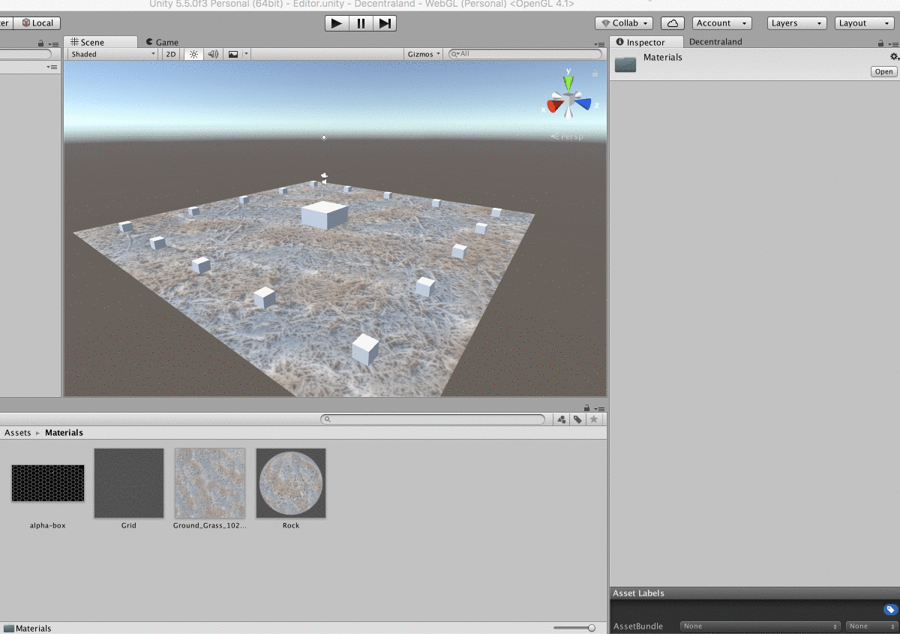

# Adding Textures

In order to serialize a texture, it needs to bee compressed in a compatible format[1] and accesible by the Decentraland Editor’s code.

Every time you import a texture, make sure to edit it’s properties on the *Inspector*.

*[1] Compatible formats: ARGB32, RGBA32, RGB24, Alpha8 on one of the float formats.*